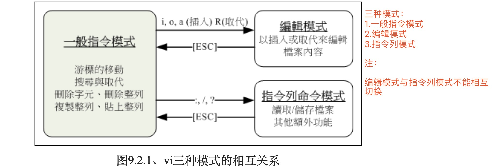
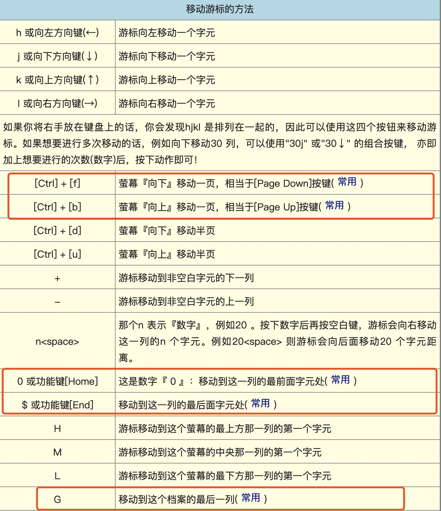
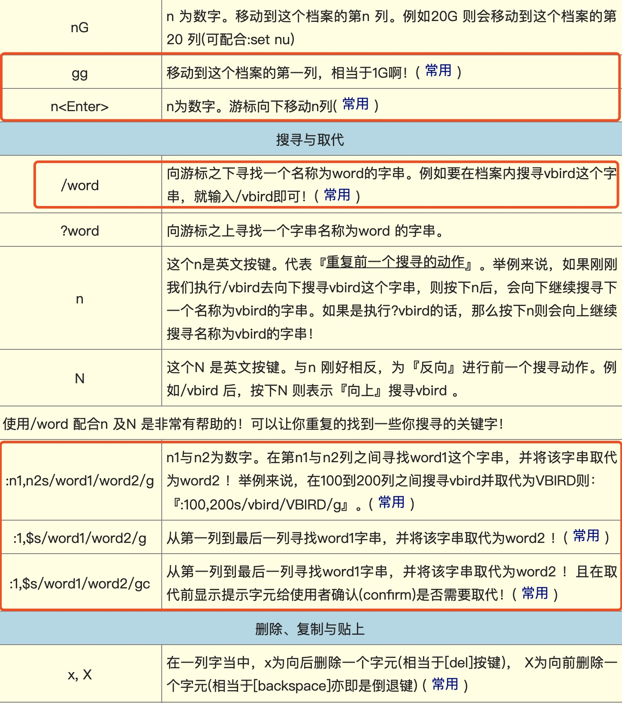
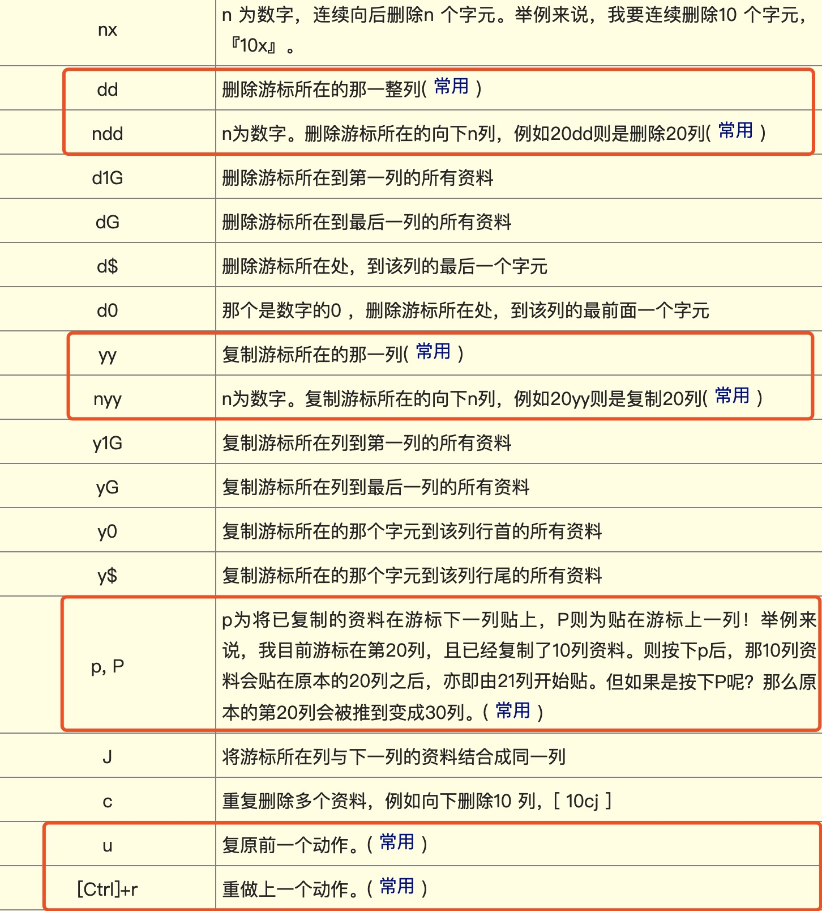
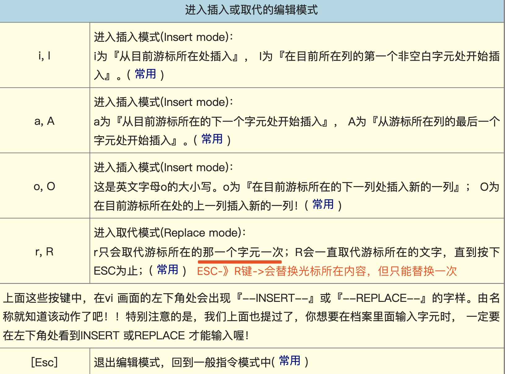
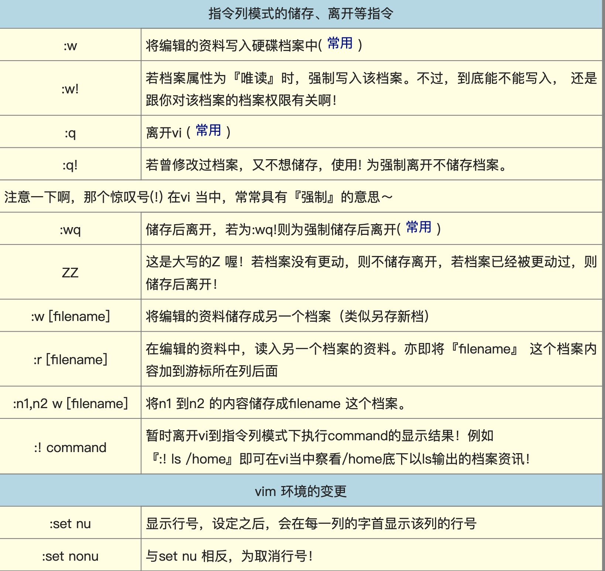
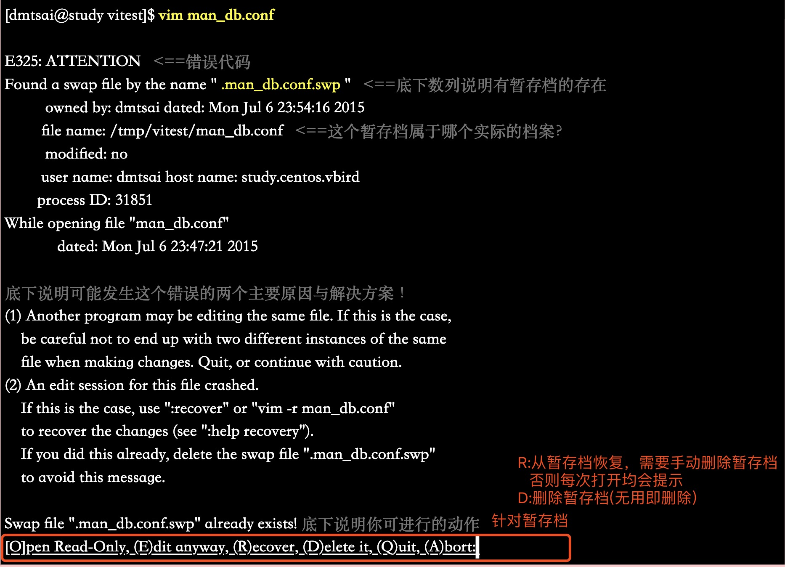
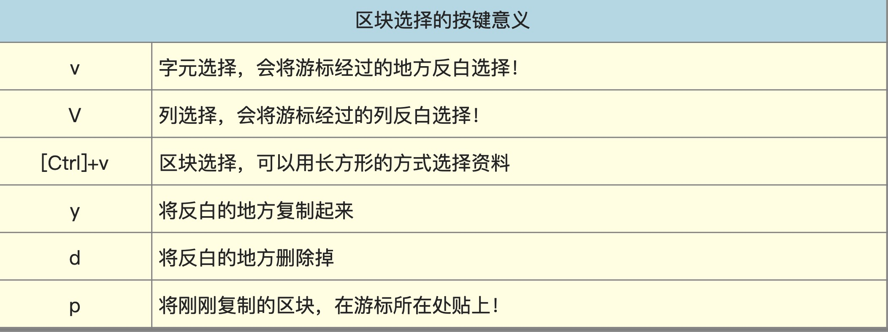
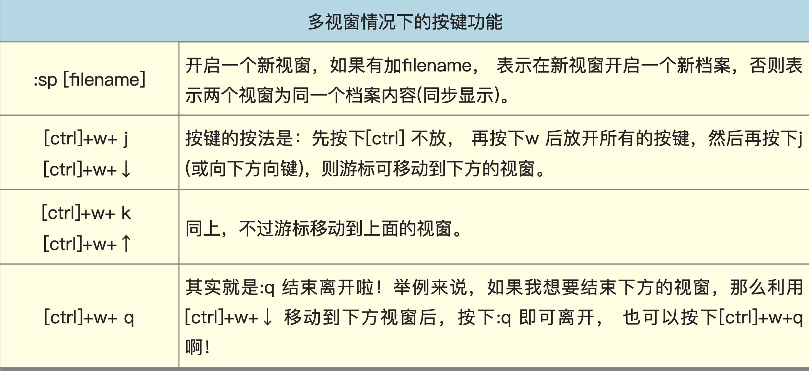
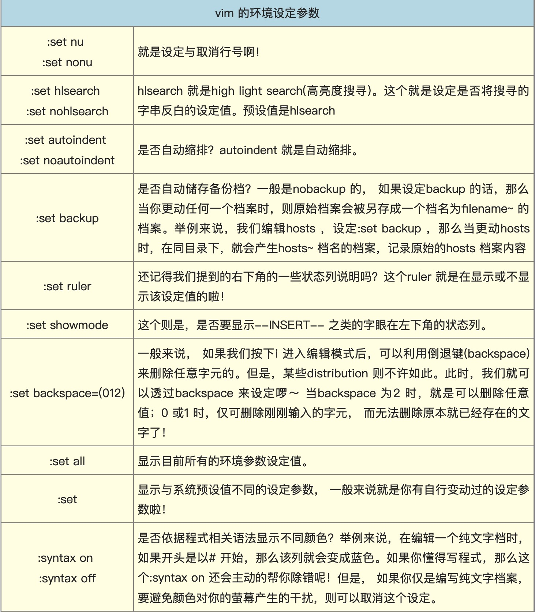

# 第9章 vim编辑器

## vi编辑器

###按键说明:

+ 第一部份：一般指令模式可用的按钮说明，游标移动、复制粘贴、搜寻取代等

+ 第二部份：一般指令模式切换到编辑模式的可用的按钮说明

+ 第三部份：一般指令模式切换到指令列模式的可用按钮说明

### vim的暂存档、救援恢复与开启时的警告讯息

**使用vim编辑时， vim会在与被编辑的档案的目录下，再建立一个名为.filename.swp的档案**

若因异常情况，文件未来得及保存，则.filename.swp即发恢作用

### vim额外功能

+ 颜色

+ 区块选择

+ 多档案编辑

    vim file1 file2 ... fileN #同时编辑多个档案
    
    
    
    **示例：$ vim domain.csr domain.key**
    
    + :files #查看当前打开了哪些文件
    
    + 文件第一列输入「4yy」复制四列 (domain.csr)
    
    + :n #切换到下一个文档 (domain.key)->「G」最后一行 「p」粘贴 #「u」还原原本资料

+ 多视窗功能

 
 
+ 挑字补全功能

+ vim 环境设定与记录： ~/.vimrc, ~/.viminfo

**$ vim ~/.vimrc**

### vim其他注意事项

+ 中文编码问题

+ DOS 与Linux 的断行字元

+ 语系编码转换

------------------------

# vim常用指令总结

### 设置/取消行号

    :set nu 或 :set number #设置行号
    
    :set nu!   #取消行号
    
    #设置每次打开都显示行号: $ vi ~/.vimrc ->添加-> set number

------------------------

[鸟哥的linux私房菜](http://linux.vbird.org/linux_basic/0310vi.php)