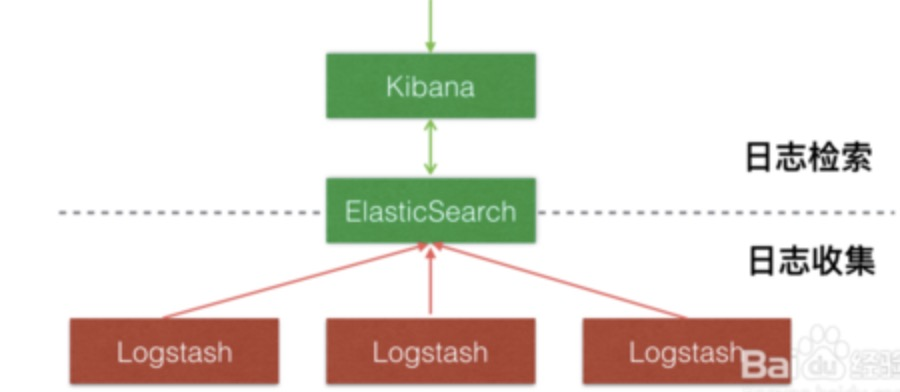
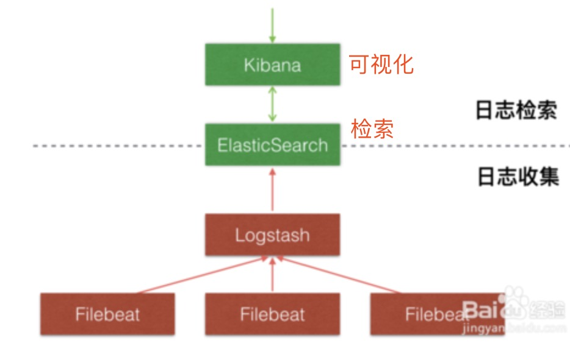
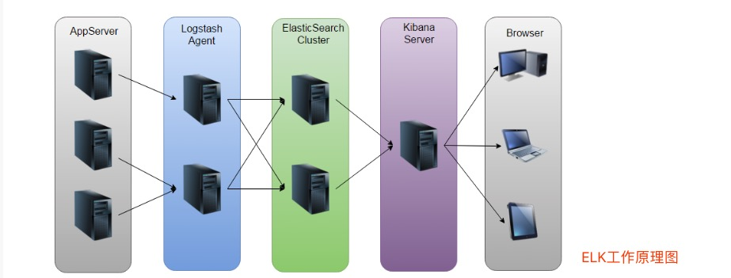

# [ELK 5.x 搭建大规模日志实时处理系统](https://www.jianshu.com/p/f3658d267b5d#)

## 一。简介

    ELK Stack 是软件集合 Elasticsearch、Logstash、Kibana 的简称，
    
    由这三个软件及其相关的组件可以打造大规模日志实时处理系统。
    
    所谓“大规模”，指的是ELK Stack组成的系统以一种水平扩展的方式支持每天收集、过滤、索引和存储TB规模以上的各类日志.
    
    通常，各类文本形式的日志都在处理范围，包括但不限于 Web 访问日志，如 Nginx/Apache Access Log
    
**基于对日志的实时分析，可以随时掌握服务的运行状况、统计 PV/UV、发现异常流量、分析用户行为、查看热门站内搜索关键词等**
    
### 1.Elasticsearch

    Elasticsearch是一个基于Lucene的、支持全文索引的分布式存储和索引引擎，主要负责将日志索引存储起来，方便业务方检索查询.
    
### 2.Logstash

    Logstash是一个日志收集、过滤、转发的中间件，主要负责将各条业务线的各类日志统一收集、过滤后，转发给 Elasticsearch 进行下一步处理.
    
### 3.Kibana

    Kibana是一个可视化工具，主要负责查询Elasticsearch的数据并以可视化的方式展现给业务方，比如各类饼图、直方图、区域图等.
    
## 二。ELK Stack系统应用架构

### 1.ELK Stack 实际应用中典型的一种架构

**未引入Filebeat**
 

**引入Filebeat**

**ELK工作原理**

    
#### (1).filebeat

    filebeat 部署在具体的业务机器上，通过定时监控的方式获取增量的日志，并转发到 Kafka 消息系统暂存
    
#### (2).Kafka

    Kafka 以高吞吐量的特征，作为一个消息系统的角色，接收从 filebeat 收集转发过来的日志，通常以集群的形式提供服务
    
#### (3).Logstash

    Logstash 从 Kafka 中获取日志，并通过 Input-Filter-Output 三个阶段的处理，更改或过滤日志，最终输出我们感兴趣的数据。通常，根据 Kafka 集群上分区(Partition)的数量，1:1 确定 Logstash 实例的数量，组成 Consumer Group 进行日志消费
    
#### (4).Elasticsearch

    Elasticsearch 存储并索引 Logstash 转发过来的数据
    
#### (5).Kibana

     Kibana 查询和可视化展示，达到实时分析日志的目的。
     
**Elasticsearch/Kibana还可以通过安装 x-pack 插件实现扩展功能，比如监控 Elasticsearch 集群状态、数据访问授权等**

## 三。Docker快速部署ELK分析Nginx日志

本次测验：主机mac,装虚拟机centos7(192.168.1.106 -node6节点),下述所有操作均在node6节点上进行。

### 1。下载镜像

    $ docker pull sebp/elk
    
### 2。运行容器

    $ mkdir -p /home/logdata

    #运行此容器的时候，需要将宿主机的端口转发到该容器，其中ES端口为9200，kibana端口为5601，logstash端口为5044
    #logstash收集+处理+切割日志；ES存储索引日志；kibana调用访问日志页面呈现
    $ docker run -p 5601:5601 -p 9200:9200 -p 5044:5044 -it --name elk sebp/elk
    
    ubuntu:docker run -d -p 5601:5601 -p 9200:9200 -p 5044:5044 -v /etc/sysctl.conf:/etc/sysctl.conf -e ES_MIN_MEM=128m  -e ES_MAX_MEM=1024m -it --name elk sebp/elk
    
### 3。测试

    $ curl http://127.0.0.1:5601
    
    #此时docker容器报错max virtual memory areas vm.max_map_count [65530] is too low, increase to at least [262144]
    
    #解决方案：
    $ sysctl -w vm.max_map_count=262144
    $ sysctl -a|grep vm.max_map_count #查看
    
    #但上述重启虚拟机会失效。解决方案
    $ vim  /etc/sysctl.conf
    #add content
    vm.max_map_count=262144   #永久修改
    
### 4。利用virtualbox，向外暴露端口5601,浏览器访问

### 4-1.检查Kibana

    http://127.0.0.1:5601
    
### 4-2.ES服务检查

    $ curl http://localhost:9200/_search?pretty  #输出json串
    
### 5。配置使用

    $ docker exec -it <container-name> /bin/bash #进入容器
    
    执行命令:
    /opt/logstash/bin/logstash -e 'input { stdin { } } output { elasticsearch { hosts => ["localhost"] } }'
    
    注意：如果看到这样的报错信息 Logstash could not be started because there is already another instance using the configured data directory.  If you wish to run multiple instances, you must change the "path.data" setting
    
    解决方案：执行如下命令:
    service logstash stop  #再执行上述命令即可
    
    命令执行成功显示：
    Successfully started Logstash API endpoint {:port=>9600}
    输入:test elk 回车
   
    #virtualbox向外暴露端口9200
    
    #浏览器访问:http://127.0.0.1:9200/_search?pretty ,返回json数据中的source中有test elk
    
### 4-3.安装filebeat

    $ curl -L -O https://artifacts.elastic.co/downloads/beats/filebeat/filebeat-7.0.0-darwin-x86_64.tar.gz
    
    $ tar zxvf filebeat-7.0.0-darwin-x86_64.tar.gz 
    
    $ vim filebeat.yml 
    
    -----------或利用rpm安装------------
    
    $ wget https://artifacts.elastic.co/downloads/beats/filebeat/filebeat-6.4.0-x86_64.rpm
     
    $ rpm -ivh filebeat-6.4.0-x86_64.rpm 
     
    $ cd /etc/filebeat/
     
    $ vim filebeat.yml 
    
    # 1.modify contents##
    filebeat.inputs:
    - type: log
         enabled: true  #modify
         paths:     
             - /usr/local/nginx/logs/user*.log #modify or add
             
    # 2.modify contents##只能保留一个，直接输出到logstash或输出到es
    output.logstash:
        hosts: ["localhost:5044"]
    #output.elasticsearch:
        #hosts: ["localhost:9200"]
        
    $ systemctl start filebeat.service
     
    $ systemctl status filebeat.service
       
参考:[Docker ElK安装部署使用教程](https://www.cnblogs.com/soar1688/p/6849183.html) 

-------------------------------------

相关参考资料：

[Elasticsearch，Logstash，Kibana（ELK）Docker镜像文档](https://elk-docker.readthedocs.io/)

[Elasticsearch - Logstash实现mysql同步数据到elasticsearch](https://my.oschina.net/xiaowangqiongyou/blog/1812708)

[docker部署ELK(logstash、elasticsearch、kibana)，监控日志](https://www.centos.bz/2019/01/docker%E9%83%A8%E7%BD%B2elklogstash%E3%80%81elasticsearch%E3%80%81kibana%EF%BC%8C%E7%9B%91%E6%8E%A7%E6%97%A5%E5%BF%97/)

   

    
    
    