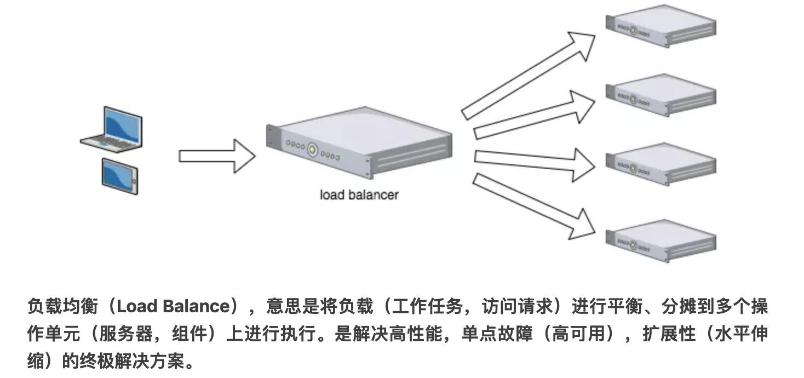
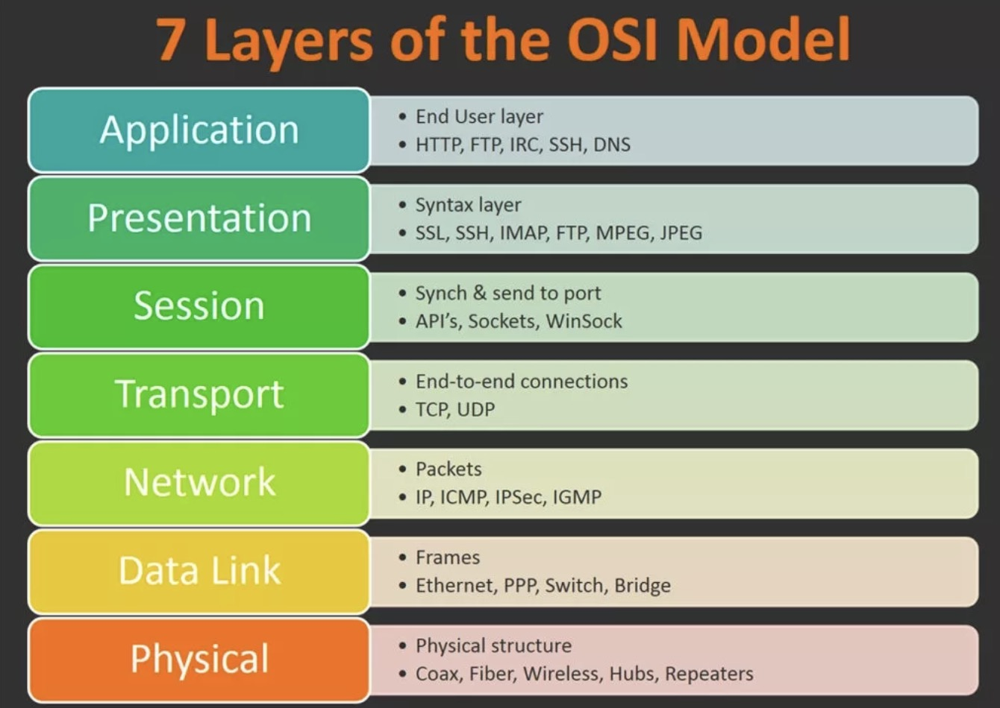
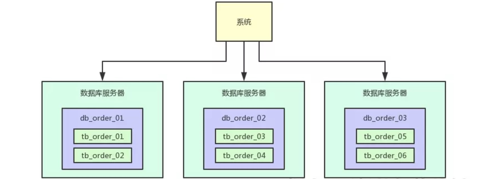
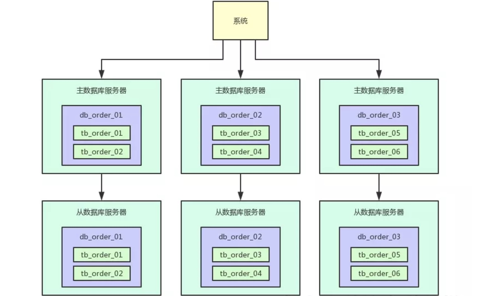

# 分布式和集群

## 分布式（distributed）

是指在多台不同的服务器中部署"不同的服务模块"，通过远程调用协同工作，对外提供服务。

## 集群（cluster）

是指在多台不同的服务器中部署"相同应用或服务模块"，构成一个集群，通过负载均衡设备对外提供服务。

## 集中式 & 集群 & 分布式部署

**集中式部署电子商务应用(集中式系统只有一台计算机提供服务)**

类比：一个饭店，仅有一个厨师(厨师不能生病，且客流量小)

**集群部署(多台计算机提供同样的服务)**

类比：一个饭店，客流量大，一个厨师以不足以支撑业务，因此聘请多个厨师，做同样的事件(客流量大，通过负载均衡分配由哪个厨师做任务)

**分布式部署(多台计算机提供不同的服务(通过把一件大的事情，拆分成多个小事情，分别交给不同的人来做))**

类比：一个饭店，厨师，洗菜等职位分工(术业有专攻),提升用户体验

[漫话：如何给女朋友解释什么是分布式和集群](https://mp.weixin.qq.com/s?__biz=Mzg3MjA4MTExMw==&mid=2247484758&amp;idx=1&amp;sn=4195022c137e260089da526caf27aa0e&source=41#wechat_redirect)

------------------------------------------------------------------------------

# 负载均衡

Load balancing，即负载均衡，是一种计算机技术，用来在多个计算机（计算机集群）、网络连接、CPU、磁盘驱动器或其他资源中分配负载，

以达到最优化资源使用、最大化吞吐率、最小化响应时间、同时避免过载的目的。

**类比：春运火车站不同入口限流策略，红色票哪个进站口，蓝色票哪个进站口...**

## OSI 七层参考模型

OSI是一个开放性的通信系统互连参考模型，他是一个定义得非常好的协议规范。

**计算机网络中相关概念**

+ telnet、HTTP、FTP、NFS、SMTP、DNS等属于第七层应用层的概念。

+ TCP、UDP、SPX等属于第四层传输层的概念。

+ IP、IPX等属于第三层网络层的概念。

+ ATM、FDDI等属于第二层数据链路层的概念。

**其中:二，三，四，七层负载均衡中最常用的是四和七层负载均衡**

## 负载均衡工具

### LVS(Linux Virtual Serve) --LVS主要用来做四层负载均衡

### Nginx(网页服务器) --Nginx主要用来做七层负载均衡

Nginx能反向代理HTTP, HTTPS, SMTP, POP3, IMAP的协议链接，以及一个负载均衡器和一个HTTP缓存

### HAProxy(c语言编写) --HAProxy主要用来做七层负载均衡

HAProxy其提供高可用性、负载均衡，以及基于TCP和HTTP的应用程序代理。

## 负载均衡算法

### 静态负载均衡算法

+ 轮询(Round Robin)
  
  顺序循环将请求一次顺序循环地连接每个服务器。当其中某个服务器发生第二到第7 层的故障，BIG-IP 就把其从顺序循环队列中拿出，不参加下一次的轮询，直到其恢复正常。

+ 比率(Ratio)

  给每个服务器分配一个加权值为比例，根椐这个比例，把用户的请求分配到每个服务器。
  
  当其中某个服务器发生第二到第7 层的故障，BIG-IP 就把其从服务器队列中拿出，不参加下一次的用户请求的分配, 直到其恢复正常。
  
+ 优先权(Priority)

  给所有服务器分组,给每个组定义优先权，BIG-IP 用户的请求，分配给优先级最高的服务器组（在同一组内，采用轮询或比率算法，分配用户的请求）；
  
  当最高优先级中所有服务器出现故障，BIG-IP 才将请求送给次优先级的服务器组。这种方式，实际为用户提供一种热备份的方式。

### 动态负载均衡算法

+ 最少连接数(Least Connection)
  
  传递新的连接给那些进行最少连接处理的服务器。当其中某个服务器发生第二到第7 层的故障，BIG-IP 就把其从服务器队列中拿出，不参加下一次的用户请求的分配, 直到其恢复正常。

+ 最快响应速度(Fastest)
 
  传递连接给那些响应最快的服务器。当其中某个服务器发生第二到第7 层的故障，BIG-IP 就把其从服务器队列中拿出，不参加下一次的用户请求的分配，直到其恢复正常。

+ 观察方法(Observed)

  连接数目和响应时间以这两项的最佳平衡为依据为新的请求选择服务器。当其中某个服务器发生第二到第7 层的故障，BIG-IP就把其从服务器队列中拿出，不参加下一次的用户请求的分配，直到其恢复正常

+ 预测法(Predictive)

  BIG-IP利用收集到的服务器当前的性能指标，进行预测分析，选择一台服务器在下一个时间片内，其性能将达到最佳的服务器相应用户的请求。(被BIG-IP 进行检测)

+ 动态性能分配(Dynamic Ratio-APM)

  BIG-IP 收集到的应用程序和应用服务器的各项性能参数，动态调整流量分配。

+ 动态服务器补充(Dynamic Server Act)

  主服务器群中因故障导致数量减少时，动态地将备份服务器补充至主服务器群。

+ 服务质量(QoS)

  按不同的优先级对数据流进行分配

+ 服务类型(ToS)

  按不同的服务类型（在Type of Field中标识）负载均衡对数据流进行分配
 
+ 规则模式

  针对不同的数据流设置导向规则，用户可自行

[漫画:负载均衡漫画版](https://mp.weixin.qq.com/s/SeERdxWRiowQMe4QAcr8oA)

------------------------------------------------------------------------------

# 数据库分库 & 分表

## 单块系统部署到一台服务器，连接一个数据库.--前期快速业务功能开发且用户访问量少

**问题:**

用户访问量上升，DB数据不断上升。一台DB服务器支撑上万请求，数据库服务器的磁盘IO、网络带宽、CPU负载、内存消耗，都会达到非常高的情况，数据库所在服务器的整体负载会非常重，甚至都快不堪重负了。

高峰期时，本来你单表数据量就很大，SQL性能就不太好，这时加上你的数据库服务器负载太高导致性能下降，就会发现你的SQL性能更差了。

## 多台服务器发库支撑高并发读写--分库(支撑高并发请求)

**思路:**

原1台数据库服务器-》5台数据库服务器；原1个库-》5个库；原1张表-》5张表

**系统访问数据库服务器(如:订单id%5=？决定将数据写入哪个DB或查询哪个DB)**

**问题：单表数据量还有可能过大导致查询性能**

## 大量分表来保证海量数据下的查询性能(保证每个表的数据量不要太大)

**思路:**

原1张表-》N张表(大量分表)

写入数据时需要做两次路由:

+ 先对订单id hash后对数据库的数量取模，可以路由到一台数据库上

+ 再对那台数据库上的表数量取模，就可以路由到数据库上的一个表里了

## 读写分离来支撑按需扩容以及性能提升(实现主库和从库按需扩容以及性能保证。)

**场景描述:**

读多写少，随用户量增加，服务器承载量大，需要扩容服务器，降低每台数据库服务器负载。因此需要涉及表迁移到新的服务器.

解决方案--读写分离(数据库一般都支持读写分离，也就是做主从架构)

**说明:**

写入的时候写入主数据库服务器，查询的时候读取从数据库服务器，就可以让一个表的读写请求分开落地到不同的数据库上去执行.

另：写入主库的时候，会自动同步数据到从库上去，保证主库和从库数据一致.

若访问量增加，则直接给主库再挂载一个新的从库即可。不需要因为读请求增长来扩容主库。

**另：需要借助数据库中间件来实现分库分表和读写分离(sharding-jdbc 或者 mycat )**

[支撑日活百万用户的高并发系统，应该如何设计其数据库架构](https://juejin.im/post/5c6a9f25518825787e69e70a)